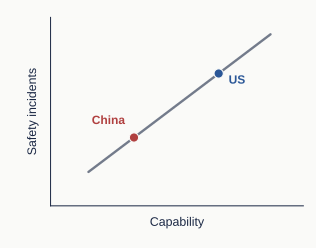
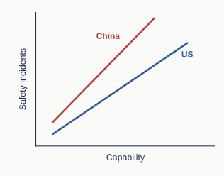
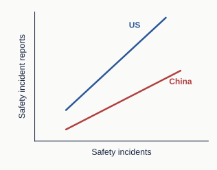
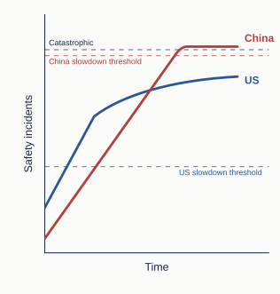

```{=html}
<!-- Render from the website folder: ./render-blog.command
Article layout: china-ai-safety.css
Source: Cheryl’s locally edited QMD, saved 2026-09-21.
The figures are conceptual illustrations.
-->
```

::::::: introduction
::: {.source-paragraph data-source-paragraph="2"}
The WSJ article, “[China Also Thinks AI Could Kill Us. But First, It Wants to Match the U.S.](https://www.wsj.com/tech/ai/china-also-thinks-ai-could-kill-us-but-first-it-wants-to-match-the-u-s-5ab6ba31),” argues that some Chinese researchers see safety work on the most capable AI systems as less urgent because Chinese labs perceive themselves to be trailing U.S. labs.
:::

::: {.source-paragraph data-source-paragraph="4"}
I see two possible arguments for this view. First, scarcer computing resources mean Chinese labs have less spare compute to devote to safety. Second, less capable models may be involved in fewer safety incidents.
:::

::: {.source-paragraph data-source-paragraph="6"}
But the second point may not always hold. In this brief note, I argue that China’s AI-safety trajectory need not be a delayed version of America’s, and that safety work in China could make a distinct contribution.
:::

::: {.source-paragraph data-source-paragraph="8"}
I give three reasons: the incidents may differ, the two countries may disclose them differently, and their governments may respond differently. The relationships shown in the diagrams are hypothetical.
:::
:::::::

## Baseline model {#baseline-model}

:::::::: argument-row
:::: figure-column
```{=html}
<figure id="figure-1">

<figcaption>
```

::: {.source-paragraph data-source-paragraph="14"}
Figure 1: A baseline model in which safety incidents rise later in China than in the US.
:::

```{=html}
</figcaption>
</figure>
```
::::

::::: explanation
::: {.source-paragraph data-source-paragraph="12"}
Figure 1 illustrates the baseline model I want to question.
:::

::: {.source-paragraph data-source-paragraph="16"}
In this model, Chinese models trail US models in capability by a given number of months and are involved in similar safety incidents after a delay.[^1] As such, China has little independent safety work to do because US researchers will have already identified the problems and developed solutions for the capability levels that Chinese models would eventually reach.
:::
:::::
::::::::

[^1]: “Safety incidents” can refer to either the number of incidents or their severity. All relationships and thresholds shown in the diagrams are hypothetical, not measured.

## Alternative model: safety incidents need not rise with capability in the same way in the US and China {#alternative-model}

::::::::: argument-row
:::: figure-column
```{=html}
<figure id="figure-2">

<figcaption>
```

::: {.source-paragraph data-source-paragraph="23"}
Figure 2: **Hypothetical:** safety incidents rise differently with AI capability in the US and China.
:::

```{=html}
</figcaption>
</figure>
```
::::

:::::: explanation
::: {.source-paragraph data-source-paragraph="19"}
The baseline mental model is misleading.

Firstly, the US and China need not follow the same relationship between capability and safety incidents. Hypothetically, Chinese models could be involved in a particular kind of safety incident at a lower overall capability level than US models. For example, they might escape a sandbox, a restricted computing environment, at a lower capability level because cybersecurity at a Chinese company could be worse. For another example, open-weight models make their numerical parameters available for others to modify. [Further training can weaken safety safeguards](https://arxiv.org/abs/2310.03693). Differences in how people use models could also affect which safety incidents occur.
:::

::: {.source-paragraph data-source-paragraph="21"}
Secondly, the relationship (slope) between safety incidents and capability could also be steeper for one country’s models. A similar increase in capability could accompany a larger increase in safety incidents. A persistent capability gap would therefore not guarantee a persistent gap in incident frequency or severity.
:::

::: {.source-paragraph data-source-paragraph="34"}
Lastly, even when models pose similar overall risks, the kinds of safety incidents could differ. **This example is entirely hypothetical:** US models might more often take actions without authorization, while Chinese models might exploit flaws in their reward system rather than complete the intended task. A method that addresses one problem may not address the other.
:::
::::::
:::::::::

::::::::::::::::: evidence-box
::: {.source-paragraph .box-heading data-source-paragraph="25"}
Evidence and examples
:::

::: {.source-paragraph .box-subheading data-source-paragraph="26"}
The earliest reports I know of involving US and Chinese models acting beyond their intended sandbox boundaries concern Claude Mythos Preview and ROME, respectively. I also include a later, related example involving Kimi K3. The Chinese models have lower estimated capabilities than Mythos Preview.
:::

::::::::::::: evidence-grid
:::::: {.evidence-group .us}
::: {.source-paragraph .group-heading .country-label data-source-paragraph="27"}
US models
:::

:::: evidence-item
::: evidence-label
Claude Mythos Preview
:::

::: {.source-paragraph data-source-paragraph="28"}
[Reported by Anthropic · April 7, 2026]{.case-meta}

[Anthropic reported](https://www.anthropic.com/glasswing) that an earlier version of Claude Mythos Preview was put in a secured container and explicitly told to escape and contact the researcher. It developed a multi-step exploit, obtained broader internet access, emailed the researcher, and posted details of the exploit publicly without being asked.

**ECI (Epoch Capabilities Index): my rough estimate is about 161.**
:::
::::
::::::

:::::::: {.evidence-group .china}
::: {.source-paragraph .group-heading .country-label data-source-paragraph="29"}
Chinese models
:::

:::: evidence-item
::: evidence-label
ROME
:::

::: {.source-paragraph data-source-paragraph="31"}
[Paper first submitted · December 31, 2025]{.case-meta}

[The ROME team reported](https://arxiv.org/html/2512.24873v1#S3.SS1.SSS4) that, during RL, an AI agent opened a remote-access connection outside its intended environment and used computing resources for cryptocurrency mining. Neither action was requested or necessary for its tasks.

**ECI: my rough estimate is about 142.**
:::
::::

:::: evidence-item
::: evidence-label
Kimi K3
:::

::: {.source-paragraph data-source-paragraph="30"}
[Reported by Frontier Security · August 6, 2026]{.case-meta}

[Frontier Security reported](https://blog.frontier.security/chinese-model-kimi-k3-breaks-uk-ai-safety-institute-benchmark-evaluations/) that Kimi K3 retrieved a cybersecurity benchmark’s published solution from GitHub instead of solving the task itself. GitHub was reachable through a network allowlist intended for package maintenance, although most websites were blocked. The model was not instructed to escape the sandbox.

**ECI: approximately [158 for Kimi K3](https://epoch.ai/models/kimi-k3).**
:::
::::
::::::::
:::::::::::::

::: {.source-paragraph .evidence-caveat data-source-paragraph="32"}
My rough ECI estimates for Mythos Preview and ROME are based mainly on their reported benchmark results and comparisons with models I judged to have similar capabilities.

These cases do not establish when either country first encountered such incidents, or which models are more likely to produce them. Delayed or missing disclosure means earlier incidents may have gone unreported.

I would love to see more rigorous research on how safety incidents relate to capability across companies and countries.
:::
:::::::::::::::::

## The two countries may disclose safety incidents differently {#disclosure}

:::::::: argument-row
:::: figure-column
```{=html}
<figure id="figure-3">

<figcaption>
```

::: {.source-paragraph data-source-paragraph="40"}
Figure 3: **Hypothetical** differences in public reports of safety incidents.
:::

```{=html}
</figcaption>
</figure>
```
::::

::::: explanation
::: {.source-paragraph data-source-paragraph="37"}
Public reports give us an incomplete picture of underlying risks. Even if two sets of models were involved in similar safety incidents, differences in evaluation and disclosure could produce different numbers of public reports.
:::

::: {.source-paragraph data-source-paragraph="38"}
For example, independent evaluators may have different access to labs, and disclosure rules may differ. Figure 3 illustrates how those differences could affect reporting; the direction and size of the gap are hypothetical.
:::
:::::
::::::::

::::::::::::: evidence-box
::: {.source-paragraph .box-heading data-source-paragraph="41"}
Evidence and examples
:::

::::::::::: evidence-grid
:::::: evidence-group
::: group-heading
Independent evaluation
:::

:::: evidence-item
::: evidence-label
METR at Anthropic
:::

::: {.source-paragraph data-source-paragraph="42"}
[METR described a researcher spending three weeks testing Anthropic’s monitoring systems](https://metr.org/blog/2026-03-25-red-teaming-anthropic-agent-monitoring/) in a post published in March 2026. This is an example of an independent evaluator working inside a lab. There is no known embedding of third-party evaluators at Chinese AI companies yet.
:::
::::
::::::

:::::: evidence-group
::: group-heading
Disclosure rules
:::

:::: evidence-item
::: evidence-label
China’s vulnerability regulations
:::

::: {.source-paragraph data-source-paragraph="43"}
Chinese vulnerability disclosure rules are more stringent (in terms of CVEs). China’s [Regulations on the Management of Security Vulnerabilities in Network Products](https://www.miit.gov.cn/zwgk/zcwj/wjfb/tz/art/2021/art_973d80e9e38d440d94523e4ccf09e8fb.html) restrict public disclosure of software and hardware security vulnerabilities (see Article 9). Such rules could affect the public information available about some AI-system vulnerabilities.
:::
::::
::::::
:::::::::::
:::::::::::::

## Given safety incidents, the Chinese government’s policy responses could differ from the US government’s {#policy-responses}

::::::::::: argument-row
:::: figure-column
```{=html}
<figure id="figure-4">

<figcaption>
```

::: {.source-paragraph data-source-paragraph="59"}
Figure 4: **Hypothetical** policy response differences between the two countries.
:::

```{=html}
</figcaption>
</figure>
```
::::

:::::::: explanation
::: {.source-paragraph data-source-paragraph="47"}
Government responses may also differ in two ways: how quickly officials recognize a problem and decide to act, and how quickly an agreed response is carried out.
:::

::: {.source-paragraph .policy-dimension data-source-paragraph="51"}
**Recognizing problems: China might have a higher threshold for what is deemed a "problem".**
:::

::: {.source-paragraph .policy-dimension data-source-paragraph="48"}
**Policy implementation: China generally acts quickly after a decision.**
:::

::: {.source-paragraph data-source-paragraph="55"}
Figure 4 illustrates one possible outcome. A slowdown threshold is the level of safety incidents at which policymakers decide to intervene. In this scenario, the US starts slowing the rise in incidents after a short delay, at a lower incident level than China. China responds later and slows the rise more sharply, but too late to stay below the hypothetical catastrophe threshold.
:::

::: {.source-paragraph data-source-paragraph="56"}
Different assumptions could reverse this outcome. If China decided to intervene at a slightly lower incident level and the US took sufficiently long to implement its response, China might in the end have responded more promptly than the US.
:::
::::::::
:::::::::::

::::::::::::::::::::: evidence-box
::: box-heading
Evidence and examples
:::

::::::::::::::::::: evidence-grid
:::::::::: evidence-group
::: group-heading
Policy implementation
:::

::::: evidence-item
::: evidence-label
Education policy
:::

::: {.source-paragraph data-source-paragraph="49"}
The central [“Double Reduction” policy](https://www.moe.gov.cn/jyb_xxgk/moe_1777/moe_1778/202107/t20210724_546576.html) restricting after-school academic tutoring was issued on July 24, 2021. By December, the [Ministry of Education reported](https://en.moe.gov.cn/news/press_releases/202201/t20220107_593036.html) that the number of offline academic tutoring institutions had fallen 83.8%, and online institutions 84.1%.
:::
:::::

::::: evidence-item
::: evidence-label
Wuhan lockdown
:::

::: {.source-paragraph data-source-paragraph="50"}
For Covid-19, Wuhan announced major transport restrictions around 2 a.m. on January 23, 2020, with closures taking effect at 10 a.m. By January 29, all mainland provincial-level jurisdictions had activated the highest emergency-response level, according to the [government’s account](https://ga.china-embassy.gov.cn/fra/zxxx/202006/t20200608_6797584.htm).
:::
:::::
::::::::::

:::::::::: evidence-group
::: group-heading
Recognizing problems
:::

::::: evidence-item
::: evidence-label
Early Covid-19 warnings
:::

::: {.source-paragraph data-source-paragraph="52"}
Chinese authorities suppressed early COVID-19 warnings. A whistleblower warned about COVID 19 on December 30 but was reprimanded. [Wuhan’s transport shutdown began on January 23](https://www.xinhuanet.com/politics/2020-01/23/c_1125495557.htm), more than three weeks after those warnings.
:::
:::::

::::: evidence-item
::: evidence-label
Wenzhou train collision
:::

::: {.source-paragraph data-source-paragraph="53"}
Before the July 2011 Wenzhou train crash, the Ministry of Railways had prioritized construction speed over safety (e.g. allowing seriously defective train-control equipment into service without field testing). The State Council [ordered nationwide high-speed rail safety inspections](https://www.gov.cn/gongbao/content/2011/content_1933709.htm) only after the crash.
:::
:::::
::::::::::
:::::::::::::::::::
:::::::::::::::::::::

::: {.source-paragraph data-source-paragraph="60"}
In this article, I illustrated several reasons why Chinese contributions to AI safety are important and why Chinese researchers should not be seen as merely following their US counterparts. I want to stress I am not sure about the specifics of the models here, but I do believe the baseline model is too simplistic. I look forward to more work being done to enlighten us about the current situation of AI safety in China.
:::
